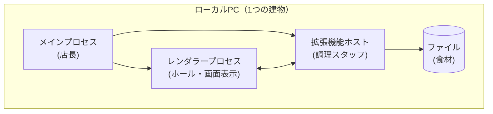
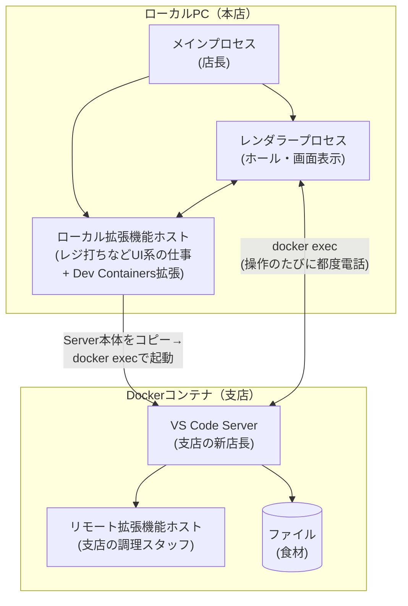

# VS Codeのプロセス構成とdevcontainerでの変化

## 結論

- 普段のVS Codeを開くと、**「メインプロセス」が親（司令塔）となって複数の子プロセスを立ち上げます。** この記事に関係するのはそのうち「レンダラープロセス」（画面表示）と「拡張機能ホスト」（拡張機能の実行役）の2つです。同じPCの中で動きます。
- devcontainerを使うと、この3つはローカルPC側でそのまま動き続けます。**それに加えて**、コンテナの中に「VS Code Server」という新しいプロセスの一式が立ち上がり、その中で"もう1つの"拡張機能ホスト（リモート拡張機能ホスト）が動き出します。ファイル操作やGit連携など、コード（ワークスペース）に直接触る仕事は、このコンテナ側の新しいメンバーが担当します。

## たとえ話:レストラン

VS Codeをレストランに例えるとこうなります。

| VS Codeの部品 | レストランでの役割 |
|---|---|
| メインプロセス | 店長。店全体の管理をする |
| レンダラープロセス | ホール（客席）。メニューを見せて注文を受ける |
| 拡張機能ホスト | 食材（コード）の鮮度チェックや盛り付け直しなど手を加える役 |
| ファイル | 食材 |

普段は「ホール」も「厨房」も同じ建物の中にあるので、店員さんはすぐ厨房に注文を伝えられます。

devcontainerを使うと、**別の建物（コンテナ）に支店の厨房を新しく開く**イメージです。本店の厨房がお引越しするのではなく、支店に**新しい店長（VS Code Server）**を着任させ、その店長が現地の調理スタッフ（リモート拡張機能ホスト）を采配し始めます。ホール（レンダラー）はお客さんの前に残ったまま、注文は電話（`docker exec`という通信手段）で支店の店長に伝える必要が出てきます。ただし、レジ打ちのような「食材を触らない仕事」（テーマ変更などのUI系拡張機能）は本店に残ったままで大丈夫です。

なお、支店の新店長（VS Code Server本体）は**支店が自分でスカウトしてくるのではなく、本店（Mac）側で用意（ダウンロード）してから送り込む**形で着任します。この手配をするのも、本店に残っている担当者（拡張機能ホストの中で動く「Dev Containers拡張」）です。支店の店長は厨房まわり（コードの処理）だけを見ており、本店の店長と違って接客（画面）は担当しません。

## 図:普段のVS Code

## 図:devcontainer使用時

## 表:何が変わるか

| 項目 | 普段 | devcontainer使用時 |
|---|---|---|
| アプリ全体の管理 | ローカル（メインプロセス） | 変わらずローカル |
| 画面表示・キー入力 | ローカル（レンダラー） | 変わらずローカル |
| テーマ等UI系の拡張機能 | ローカル（拡張機能ホスト） | 変わらずローカル |
| Git連携・言語サーバー等 | ローカル（拡張機能ホスト） | **コンテナ内に新設**（リモート拡張機能ホストが担当） |
| ファイルの読み書き | ローカル | **コンテナ内に新設**（VS Code Serverが担当） |
| ターミナル/VS Code Serverの実行ユーザー | ローカルログインユーザー | `remoteUser`（devcontainer.json。未指定なら`containerUser`＝Dockerfile最後の`USER`を継承） |

## 補足:docker execとユーザー

- VS Code Serverの初回起動も、起動後の通信（ターミナルを開く・タスク実行など）も、実体はすべて`docker exec`。**接続確立後に別経路へ切り替わるわけではなく**、操作のたびに新しい`docker exec`が実行され続ける。
- `docker exec`で動くプロセス（VS Code Server本体・ターミナル・タスク・デバッグ）の実行ユーザーは`remoteUser`で決まる。本プロジェクトでは`remoteUser: "node"`（`.devcontainer/devcontainer.json`）が明示されているため、これらはすべて`node`ユーザーで動く。

## まとめ

devcontainerを使っても、画面表示（レンダラー）とアプリ管理（メインプロセス）はローカルPCに残ったまま動き続ける。変わるのは、ワークスペースに触る仕事（拡張機能ホストの一部とファイル操作）が、コンテナ内に**新しく立ち上がった**VS Code Serverへ引き継がれる点。誤解しやすいのは「既存のプロセスが移動する」という見方で、実際は**ローカル側の顔ぶれ（メインプロセス・レンダラー・ローカル拡張機能ホスト）はそのまま残り、コンテナ側に新しい仲間が増える**、というのが正確なイメージ。
