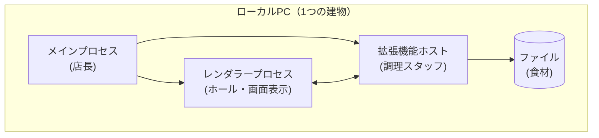
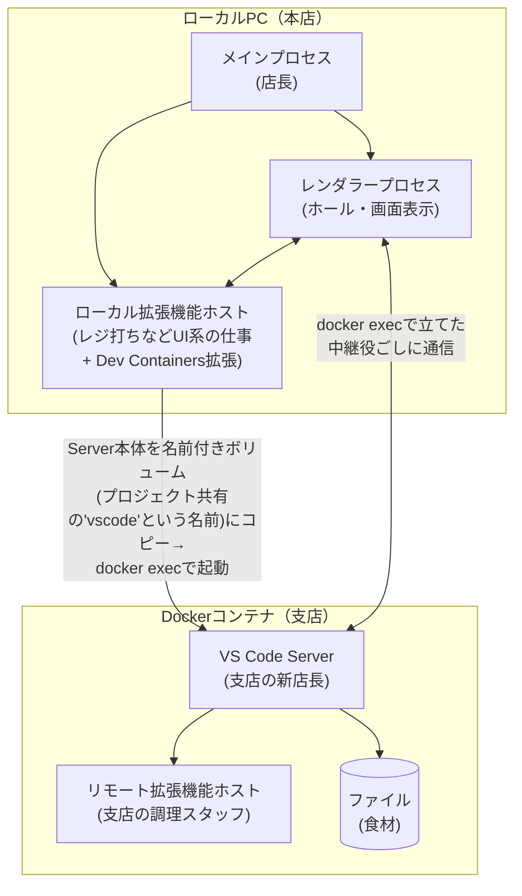

# VS Codeのプロセス構成とdevcontainerでの変化

## 結論

- 普段のVS Codeを開くと、**「メインプロセス」が親（司令塔）となって複数の子プロセスを立ち上げます。** この記事に関係するのはそのうち「レンダラープロセス」（画面表示）と「拡張機能ホスト」（拡張機能の実行役）の2つです。同じPCの中で動きます。
- devcontainerを使うと、この3つはローカルPC側でそのまま動き続けます。**それに加えて**、コンテナの中に「VS Code Server」という新しいプロセスの一式が立ち上がり、その中で"もう1つの"拡張機能ホスト（リモート拡張機能ホスト）が動き出します。ファイル操作やGit連携など、コード（ワークスペース）に直接触る仕事は、このコンテナ側の新しいメンバーが担当します。

## たとえ話:レストラン

VS Codeをレストランに例えるとこうなります。

| VS Codeの部品 | レストランでの役割 |
|---|---|
| メインプロセス | 店長。店全体の管理をする |
| レンダラープロセス | ホール（客席）。メニューを見せて注文を受ける |
| 拡張機能ホスト | 厨房のスタッフ。食材（コード）の鮮度チェックや盛り付け直しなど手を加える役 |
| ファイル | 食材 |

普段は「ホール」も「厨房」も同じ建物の中にあるので、店員さんはすぐ厨房に注文を伝えられます。

devcontainerを使うと、**別の建物（コンテナ）に支店の厨房を新しく開く**イメージです。本店の厨房がお引越しするのではなく、支店に**新しい店長（VS Code Server）**を着任させ、その店長が現地の調理スタッフ（リモート拡張機能ホスト）を采配し始めます。ホール（レンダラー）はお客さんの前に残ったまま、注文は電話（`docker exec`という通信手段）で支店の店長に伝える必要が出てきます。ただし、レジ打ちのような「食材を触らない仕事」（テーマ変更などのUI系拡張機能）は本店に残ったままで大丈夫です。

なお、支店の新店長（VS Code Server本体）は**支店が自分でスカウトしてくるのではなく、本店（Mac）側で用意（ダウンロード）してから送り込む**形で着任します。この手配をするのも、本店に残っている担当者（拡張機能ホストの中で動く「Dev Containers拡張」）です。支店の店長は厨房まわり（コードの処理）だけを見ており、本店の店長と違って接客（画面）は担当しません。

## 図:普段のVS Code



## 図:devcontainer使用時



## 表:何が変わるか

| 項目 | 普段 | devcontainer使用時 |
|---|---|---|
| アプリ全体の管理 | ローカル（メインプロセス） | 変わらずローカル |
| 画面表示・キー入力 | ローカル（レンダラー） | 変わらずローカル |
| テーマ等UI系の拡張機能 | ローカル（拡張機能ホスト） | 変わらずローカル |
| Git連携・言語サーバー等 | ローカル（拡張機能ホスト） | **コンテナ内に新設**（リモート拡張機能ホストが担当） |
| ファイルの読み書き | ローカル | **コンテナ内に新設**（VS Code Serverが担当） |
| ターミナル/VS Code Serverの実行ユーザー | ローカルログインユーザー | `remoteUser`（未指定なら`containerUser`＝Dockerfile最後の`USER`） |

## 補足:docker execによる通信と実行ユーザー

- **VS Code Serverの初回起動は`docker exec`。** ローカル側のDev Containers拡張が、名前付きボリューム(プロジェクト共有の'vscode'という名前)にコピーしておいたServer本体を`docker exec`でコンテナ内に起動する。

  ただし`docker exec`で起動されるのはServer本体だけではない。後述する中継プロセス用のシェルなど、起動時には複数回の`docker exec`が走る。

- **起動後の通信も入口は`docker exec`だが、実体はもう一段細かい。** VS Code Serverは起動すると、コンテナの中のポート（`127.0.0.1`の空き番号）で待ち受ける。`docker exec`で起動されるのは会話の中身を運ぶ本体ではなく、**その待ち受けポートへ橋渡しするだけの細い中継役プロセス**である。

  ```
  ローカルのVS Code
     │  標準入出力(stdin/stdout)でやりとり
     ▼
  中継プロセス  ← docker execで起動された小さなプログラム
     │  コンテナ内のTCP接続(127.0.0.1:ポート番号)
     ▼
  VS Code Server  ← 127.0.0.1:ポート番号で待ち受けている
  ```

  たとえ話にすると、`docker exec`は**電話線そのものではなく、回線をつないでくれる交換手**にあたる。いったん交換手につないでもらえば、あとは本店と支店はその回線で会話を続けられる。

- **ターミナルを開くたびに新しい`docker exec`が飛ぶわけではない。** ターミナル・タスク・デバッグは、外から送り込まれるのではなく、**すでにコンテナ内で動いているVS Code Serverの子プロセス**として生まれる。支店の店長が自分の部下に指示を出しているイメージで、注文のたびに本店から人が派遣されるわけではない。

- **実行ユーザーは`remoteUser`で決まる。** VS Code Server本体と、そこから生まれる子プロセス（ターミナル・タスク・デバッグ）はすべてこのユーザーの権限で動く。本プロジェクトでは`remoteUser: "node"`（`.devcontainer/devcontainer.json`）が明示されているため、これらはすべて`node`ユーザーで動く。

## まとめ

devcontainerを使っても、画面表示（レンダラー）とアプリ管理（メインプロセス）はローカルPCに残ったまま動き続ける。変わるのは、ワークスペースに触る仕事（拡張機能ホストの一部とファイル操作）が、コンテナ内に**新しく立ち上がった**VS Code Serverへ引き継がれる点。誤解しやすいのは「既存のプロセスが移動する」という見方で、実際は**ローカル側の顔ぶれ（メインプロセス・レンダラー・ローカル拡張機能ホスト）はそのまま残り、コンテナ側に新しい仲間が増える**、というのが正確なイメージ。

## 付録:そもそも`docker exec`とは何か

### ひとことで言うと

**「動いているコンテナの中に新しいプロセスを1個生やし、その入出力を手元の画面につなぐ」コマンド。**

コンテナに「入る」コマンドではなく、コンテナの中にプロセスを「増やす」コマンドである、というのが要点。

### 処理の流れ

`docker exec -it <コンテナ> bash` と打ったときに起きること。

```
[Macのターミナルのbash]
      │ ① 「docker」という実行ファイルを子プロセスとして起動するだけ。
      │    bash自身はDockerのことを何も知らない。
      ▼
[docker CLIプロセス]  ← ただのMacのプログラム。正体はHTTPクライアント
      │ ② Docker Engine APIをソケット経由で送る
      │      POST /containers/{id}/exec  … 新プロセスの「予約」を作る
      │      POST /exec/{id}/start       … 実行開始＋入出力を接続
      ▼
[dockerd（Dockerエンジン）]  ← 常時待ち受けているデーモン(常駐プログラム)
      │ ③ 指定されたコンテナの中に、新しいプロセス(この例では bash プロセス)を1個作る
      ▼
[コンテナ内の新プロセス]  ← PID 1 の子ではなく、独立した新入り
      │ ④ 新プロセスのstdin/stdout/stderrをdockerdが握り、
      │    ②で張ったコネクションに載せてCLIへ返す
      ▼
[手元の画面に出力される]
```

なお Mac の場合、`dockerd` は macOS 上ではなく **Docker Desktop が動かしている Linux VM の中**にいる（コンテナは Linux の機能なので Linux 本体が要る）。docker CLI から VM への橋渡しは Docker Desktop が受け持つ。

### 起動されるのはコンテナ内の「普通のプログラム」

`docker exec -it <コンテナ> bash` の `bash` は、**コンテナのファイルシステムにある`/bin/bash`を実行しろ**という指示。特殊な仕組みではなく、ごく普通のバイナリがごく普通に起動されるだけ。

そのため、イメージに`bash`が入っていなければ`executable file not found`で失敗する（alpine系イメージでよく起きる）。

### 本プロジェクトに効いてくる性質2つ

- **PID 1 が死ぬと、`docker exec`で作ったプロセスも全部道連れになる。** `docker-compose.yml`の`command: sleep infinity`は、PID 1 を生かし続けてVS Code Serverの居場所を保つためのもの。
- **環境変数はコンテナ作成時に設定されたものを継承する。** `docker-compose.yml`の`environment:`に書いた`CLAUDE_CONFIG_DIR`が、VS Codeのターミナルにもそのまま効くのはこのため。

### devcontainerとの関係

上の図の「コンテナ内の新プロセス」として起動されるものが、**VS Code Server本体**にあたる。その実行ユーザーが`remoteUser`で決まる、というのが本文の内容。
