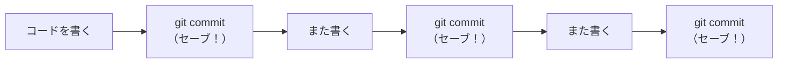
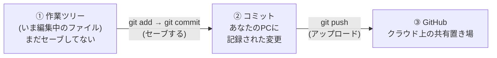
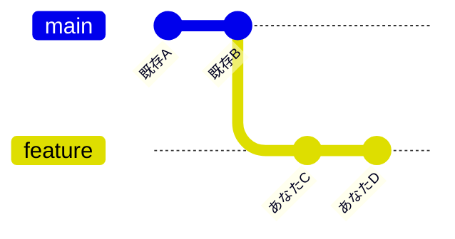
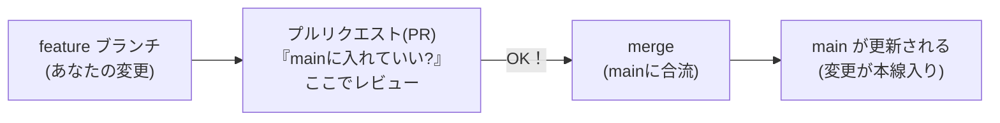
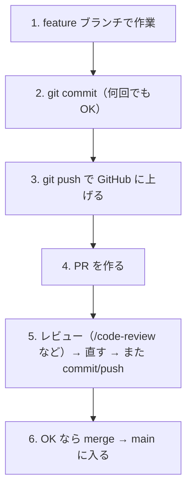
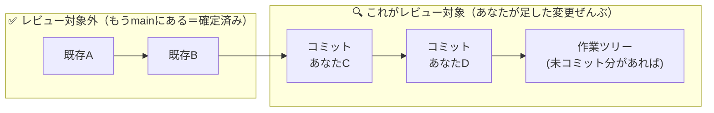
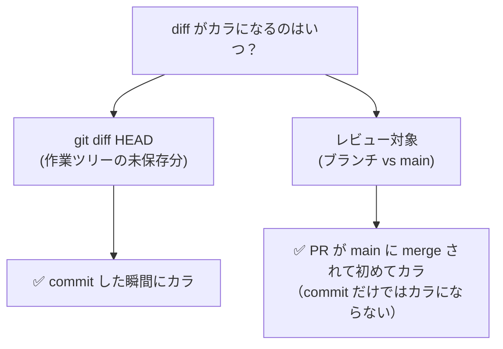
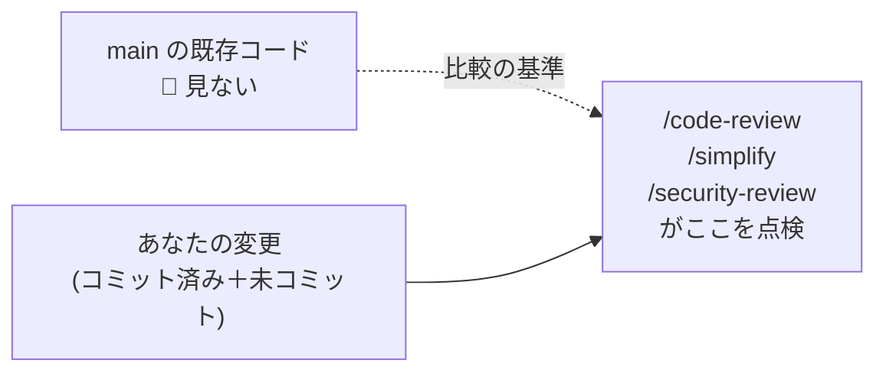
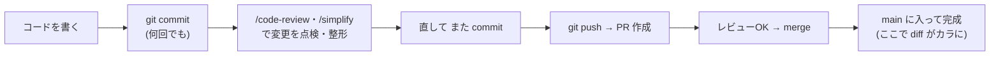

# Git / GitHub ゼロから入門 〜「diff」と「レビュー対象」がわかる〜

> このファイルは、Git も GitHub も初めての人向けに、最初から順番に説明します。
> 最後に「コードレビュー(`/code-review` や `/simplify`)が**どの部分**を見ているのか」がわかるようになります。

---

## このファイルの図(mermaid)を「絵」で見る方法

このページには `mermaid` という記法で図を書いています。ターミナルでは絵になりませんが、次のどれかで**ちゃんとした図**として見られます。

- **一番かんたん**: このファイルを GitHub にアップロードして開く（GitHub は mermaid を自動で絵にします）
- **VS Code**: このファイルを開いて右上の「プレビュー」ボタン（または `Cmd/Ctrl + Shift + V`）。
  - もし図が出ないときは、拡張機能 **「Markdown Preview Mermaid Support」** を入れるとプレビューで絵になります。
- **コピペで試す**: 図の ```` ```mermaid ```` の中身をコピーして、ブラウザで [https://mermaid.live](https://mermaid.live) に貼ると即プレビューできます。

> 各図には、絵が出なくても読めるように**文字だけの図**も併記しています。

---

## 1. そもそも Git ってなに？

**Git = コードの「セーブ」を作る道具**です。ゲームのセーブと同じイメージ。

- 作業して、区切りがいいところで「セーブ」する。
- このセーブ1個1個を **コミット (commit)** と呼びます。
- あとから「3つ前のセーブに戻す」「いつ・どこを変えたか見る」ことができます。



文字の図:

```
[書く] → commit → [書く] → commit → [書く] → commit
         (セーブ1)         (セーブ2)         (セーブ3)
```

この「セーブの列」がたまっていく入れ物全体を **リポジトリ (repository / repo)** と呼びます。
このプロジェクトのフォルダ自体がリポジトリです。

---

## 2. 変更が通る「3つの場所」※ここが一番大事

あなたがコードを変更してから、それがチームの本番に入るまで、変更は**3つの場所**を順番に通ります。



文字の図:

```
①作業ツリー   ──commit──▶   ②コミット(自分のPC)   ──push──▶   ③GitHub(クラウド)
(編集中・未保存)            (セーブ済み・手元)                  (みんなと共有)
```

| 場所 | これは何？ | たとえると |
|---|---|---|
| ① 作業ツリー | 今まさに編集している、まだセーブしてないファイル | 書きかけの下書き |
| ② コミット | `git commit` でセーブした変更（自分のPCの中） | セーブ済みデータ |
| ③ GitHub | `git push` でクラウドに上げた状態。他人も見られる | クラウドに保存・共有 |

> **覚えておくと混乱しないポイント**
> 「① → ②」が `commit`、「② → ③」が `push`。
> **コミットしただけでは、まだクラウド(GitHub)には上がっていません。**

---

## 3. ブランチ (branch) ってなに？

**ブランチ = 作業用の「別レーン」**です。

チームのコードの本線（みんなが使う完成版）を **main(メイン)** と呼びます。
main を直接いじると危ないので、自分の作業は **枝分かれした別レーン**で行います。これがブランチです。



文字の図:

```
main:     既存A ── 既存B
                      \
feature:               あなたC ── あなたD     ← あなた専用の作業レーン
```

- **main**: チームの本線（完成版）。`既存A`, `既存B` はもう入っている確定済みの内容。
- **feature**: あなたが `既存B` の地点から枝分かれして作った自分のレーン。`あなたC`, `あなたD` はあなたが足したコミット。

こうすれば、あなたが作業中でも main は壊れません。
作業が終わったら、自分のレーンの変更を main に**合流**させます（→ 次の章）。

---

## 4. GitHub・プルリクエスト(PR)・マージ(merge)

**GitHub** は、リポジトリをクラウドに置いて、みんなで共同作業するためのサービスです。

作業レーン(feature)の変更を main に入れたいとき、いきなり入れずに
**「この変更を main に入れていいですか？」というお伺い**を立てます。これが
**プルリクエスト (Pull Request, 略して PR)** です。

PR の場で、本人以外の人（または AI）が変更を点検します。これが**コードレビュー**。
OK が出たら main に合流させます。この合流が **マージ (merge)** です。



文字の図:

```
feature ──▶ 【PR】ここでレビュー ──OK──▶ merge ──▶ main に合流して完成
```

流れをまとめると:



---

## 5. 「diff(差分)」ってなに？ ※あなたが混乱した所

**diff = 「どこが変わったか」の差分**です。
ただし Git には「何と何を比べるか」で **2種類の diff** があり、ここが混乱のもとです。

### diff その1: `git diff HEAD`（作業ツリー vs 直近のセーブ）

「**まだセーブしてない編集**」を見るもの。
→ **`git commit` した瞬間にカラ**になります（セーブして②へ移ったから）。

```
あなたが「コミットしたら diff がゼロになる」と思ったのは、コレのことです。
```

### diff その2: レビューが使うのは「ブランチ vs main」

コードレビューが見る diff は、こっちです。
**「あなたのブランチが main に対して新しく足した変更ぜんぶ」**を指します。



文字の図:

```
   ✅ 対象外（main に確定済み）        🔍 レビュー対象（あなたの変更）
  ┌────────────────────┐   ┌─────────────────────────────┐
   既存A ──── 既存B   ──▶   あなたC ── あなたD ── (未コミット編集)
  └────────────────────┘   └─────────────────────────────┘
```

> **だから「コミットしても diff はゼロにならない」**
> レビューの基準は「main と比べてどう違うか」なので、
> あなたが `あなたC` や `あなたD` をコミット済みでも、**main に入るまで**は
> ずっと「あなたが足した変更」として対象に残ります。

### いつカラになるの？



| 見方 | 何と比べる？ | コミットすると | カラになるのは |
|---|---|---|---|
| `git diff HEAD` | 作業ツリー ⇄ 直近コミット | **ゼロになる** | commit した時 |
| レビュー対象 | あなたのブランチ ⇄ main | **ゼロにならない** | **merge された時** |

---

## 6. レビュー系スキルは「どこ」を見ている？

`/code-review`(バグ点検)・`/simplify`(品質整形)・`/security-review`(脆弱性点検) の3つは、
どれも **「あなたがこのブランチで main に足そうとしている変更ぜんぶ」**（＝ diff その2）を見ます。
**main の既存コード（確定済み）は見ません。**



| スキル | 何を探す | 対象 |
|---|---|---|
| `/code-review` | 動作のバグ（正しさ） | あなたの変更（ブランチ vs main） |
| `/simplify` | コードの品質（重複・冗長・効率など） | 同じ「あなたの変更」 |
| `/security-review` | セキュリティの穴 | ブランチの変更分 |

### 結論：あなたが気にしていた点への答え

- **「コミット前に急いでレビューしないとダメ?」→ いいえ。**
  安心して `git commit` を何回でもしてOK。
  PR を出す前でも後でも、好きなタイミングでレビューを回せます。
- レビューの対象は常に「**main と比べて、あなたが足した変更ぜんぶ**」。
  コミットしてもマージするまで消えません。

---

## 7. まとめ（最短の流れ）



文字の図:

```
書く → commit → レビュー(/code-review,/simplify) → 直す → push → PR → merge → 完成
                  ▲ ここで見るのは「mainと比べた、あなたの変更ぜんぶ」
```

---

### 用語ミニ辞典

| 用語 | よみ | 意味（ざっくり） |
|---|---|---|
| repository / repo | リポジトリ | コードとセーブ履歴が入った入れ物（＝プロジェクトのフォルダ） |
| commit | コミット | 変更のセーブ1個 |
| 作業ツリー | さぎょうツリー | いま編集中の、まだコミットしてないファイル群 |
| branch | ブランチ | 作業用の別レーン。本線は `main` |
| push / pull | プッシュ / プル | 自分のPC ⇄ GitHub のアップロード / ダウンロード |
| Pull Request (PR) | プルリクエスト | 「この変更を main に入れていい?」のお伺い＆レビューの場 |
| merge | マージ | 変更を main に合流させること |
| diff | ディフ | 差分。「どこが変わったか」。比べる基準で2種類ある |
