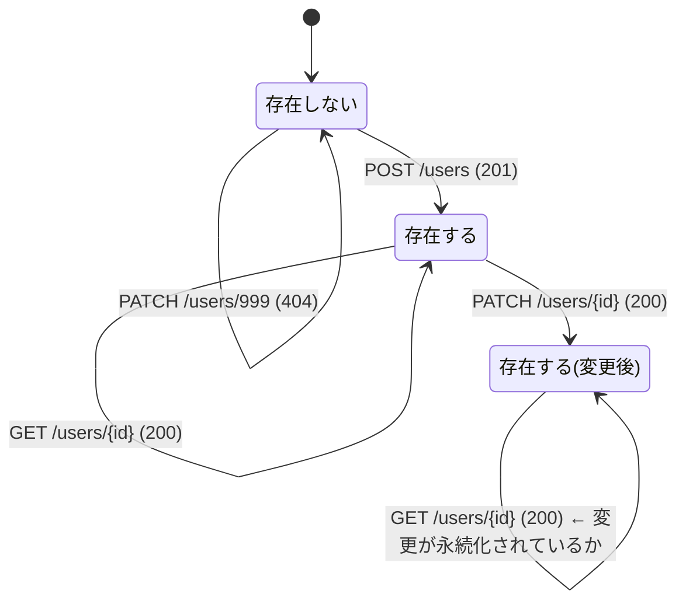

# テストレビュー & テスト設計ガイドライン

## Part 1: `test_users.py` のレビュー

### 良い点 👍

テスト全体の品質は高いです。以下の点が特に良い：

1. **空リストのテスト** (`test_get_users_empty`) — `[]` ではなく `404` や `null` を返すバグを防ぐ、地味だが重要なガード
2. **Optional フィールドの3パターン** — 省略 / 空白のみ / 正常値の3つを網羅
3. **部分更新 (PATCH) の非変更フィールド検証** — 変更していないフィールドが壊れていないことの確認
4. **エラーレスポンス構造の検証** — `status_code` だけでなく `error.code` まで見ている
5. **空ボディの PATCH** (`test_update_user_empty_body`) — no-op 更新が安全であることの検証

### 指摘事項

#### 1. 重大な抜け: email ユニーク制約のテストがない

モデルに `unique=True`、DBに `UNIQUE` 制約があるが、重複 email のテストがない。これは本番でほぼ確実に発生するシナリオ。

```python
# CREATE で重複
def test_create_user_duplicate_email(test_client: TestClient, test_user: User):
    post_data = {"name": "Another", "email": test_user.email}
    response = test_client.post("/api/v1/users", json=post_data)
    assert response.status_code == 409  # or whatever your app returns

# UPDATE で他人の email に変更
def test_update_user_duplicate_email(db_session: Session, test_client: TestClient, test_user: User):
    other = User(name="Other", email="other@gmail.com")
    db_session.add(other)
    db_session.commit()
    response = test_client.patch(
        f"/api/v1/users/{test_user.id}",
        json={"email": other.email},
    )
    assert response.status_code == 409
```

> [!WARNING]
> 現状、`CONSTRAINT_RESPONSES` に `users.email` のマッピングが**ない**ため、重複 email は `500 Internal Server Error` になるはずです。テストを書くことでこのバグを発見できます。これが TDD / テストファーストの真価です。

#### 2. email バリデーションのテストがない

`EmailStr` が不正な email を弾くことを確認するテストがない：

```python
def test_create_user_invalid_email(test_client: TestClient):
    post_data = {"name": "Tom", "email": "not-an-email"}
    response = test_client.post("/api/v1/users", json=post_data)
    assert response.status_code == 422
    assert response.json()["error"]["code"] == "VALIDATION_ERROR"
    assert "email" in response.json()["error"]["details"]
```

「Pydantic がやってくれるから不要」と思うかもしれないが、テストの役割は**実装の正しさではなく、APIの契約を固定すること**。将来 `EmailStr` を外しても、このテストが壊れて気づける。

#### 3. `test_create_user_short_name` の検証が甘い

`test_update_user_short_name` では `"name" in data["error"]["details"]` まで確認しているのに、`test_create_user_short_name` ではそこまで見ていない。**同じ境界条件なのにチェックの深さが違う**のは、テストのガードレールに穴があるということ。

```python
# 現状
def test_create_user_short_name(test_client: TestClient):
    ...
    assert data["error"]["code"] == "VALIDATION_ERROR"
    # ← ここで終わり。何のバリデーションエラーか不明

# 改善案
def test_create_user_short_name(test_client: TestClient):
    ...
    assert data["error"]["code"] == "VALIDATION_ERROR"
    assert "name" in data["error"]["details"]  # ← 原因の特定
```

#### 4. ソート順のテストが抜けている

`crud_user.get_users` は `order_by(User.id.desc())` を明示的に指定しているが、テストでは `set` 比較しか行っていない。ソート順が API 契約の一部なら、テストで固定すべき：

```python
def test_get_users(db_session: Session, test_client: TestClient):
    user1 = User(name="user1", email="test1@google.com")
    user2 = User(name="user2", email="test2@google.com")
    db_session.add_all([user1, user2])
    db_session.commit()
    response = test_client.get("/api/v1/users")
    data = response.json()
    assert len(data) == 2
    assert {user["name"] for user in data} == {"user1", "user2"}
    # ソート順の契約を固定する
    assert data[0]["id"] > data[1]["id"]  # desc order
```

#### 5. `updated_at` の変更検証がない

PATCH で更新した後、`updated_at` が実際に変わったかのテストがない。これはタイムスタンプ系のバグを検出する重要なガード：

```python
def test_update_user_updates_timestamp(test_client: TestClient, test_user: User):
    original_updated_at = test_user.updated_at
    response = test_client.patch(
        f"/api/v1/users/{test_user.id}",
        json={"name": "Updated"},
    )
    assert response.status_code == 200
    # updated_at が更新されていること（SQLiteの精度の問題で同一の場合がある点は注意）
    assert response.json()["updated_at"] >= original_updated_at.isoformat()
```

#### 6. レスポンスのスキーマ形状チェックが不完全

`test_create_user` では `"id" in data` や `"created_at" in data` でキーの存在を見ているが、`test_get_users` や `test_get_user_by_id` ではレスポンスの形状を全くチェックしていない。

```python
def test_get_user_by_id(db_session: Session, test_client: TestClient):
    ...
    data = response.json()
    assert data["id"] == user2.id
    assert data["name"] == "user2"
    # 以下も検証すべき：APIの返り値の「形」を固定する
    assert "email" in data
    assert "created_at" in data
    assert "updated_at" in data
```

---

## Part 2: テスト設計のガイドライン — 「何をテストするか」の体系

ご指摘の通り、**テストの価値はテストを書くこと自体ではなく、何をどうチェックするかで決まります**。以下にガードレールの敷き方の体系を示します。

### 体系1: 入力空間の分割 — 境界値分析とドメイン分割

あるフィールドに対して、テストすべき入力は以下のように分類できます：

```
        無効              有効                  無効
  ◄──────────────┤────────────────────────┤──────────────►
               境界(内)                  境界(内)
             境界(外)                      境界(外)
```

`name` フィールドの場合（`min_length=2, max_length=50`）：

| カテゴリ | 値 | 期待 | テスト有無 |
|---|---|---|---|
| 境界外(下) | `""` (0文字) | 422 | ❌ なし |
| 境界値(下) | `"A"` (1文字) | 422 | ✅ `test_create_user_short_name` |
| 境界値(内側下) | `"AB"` (2文字) | 201 | ❌ なし |
| 正常値 | `"Tom"` (3文字) | 201 | ✅ `test_create_user` |
| 境界値(内側上) | 50文字の名前 | 201 | ❌ なし |
| 境界値(上) | 51文字の名前 | 422 | ❌ なし |

> [!IMPORTANT]
> **境界値テストの原則**: 有効/無効の切り替わるポイント（境界）の**両側**をテストする。片側だけでは、境界が1つズレるバグ（off-by-one）を検出できない。

現状は「1文字 → 422」だけで、「2文字 → 201（成功）」がない。もし実装が `min_length=3` に誤って変更されても、このテストスイートは通ってしまう。

### 体系2: 状態遷移とライフサイクル

CRUD リソースには「状態」がある。テストは状態遷移の各パスを検証すべき：



**欠けている遷移テスト:**
- **CREATE → GET の往復（ラウンドトリップ）**: POST で作成した直後に GET で取得し、データが一致するか。これがないと「レスポンスは正しいがDBには書き込まれていない」バグを見逃す。
- **UPDATE → GET の往復**: PATCH した後に GET で取得し、変更が反映されているか。

```python
def test_create_then_get_roundtrip(test_client: TestClient):
    """POST で作った User が GET で取得でき、データが一致すること"""
    post_data = {"name": "Tom", "email": "tom@gmail.com"}
    create_resp = test_client.post("/api/v1/users", json=post_data)
    created = create_resp.json()

    get_resp = test_client.get(f"/api/v1/users/{created['id']}")
    assert get_resp.status_code == 200
    assert get_resp.json() == created  # 完全一致
```

### 体系3: エラーカテゴリの網羅

API が返しうるエラーを分類し、各カテゴリにテストがあるか確認する：

| エラーカテゴリ | HTTP Status | 発生源 | テスト有無 |
|---|---|---|---|
| パス変数の型違反 | 422 | FastAPI 自動 | ✅ `test_get_user_by_id_invalid_id` |
| リクエストボディのバリデーション違反 | 422 | Pydantic schema | ✅ 部分的 |
| リソースが見つからない | 404 | アプリロジック | ✅ |
| ユニーク制約違反 | 409 (あるべき) | DB 制約 | ❌ **なし** |
| 不正な email 形式 | 422 | Pydantic `EmailStr` | ❌ **なし** |
| サーバー内部エラー | 500 | 予期しない例外 | ❌ **なし** |

> [!CAUTION]
> エラーカテゴリに1つでも抜けがあると、そのパスでの回帰バグは検出できない。特にDB制約違反のテストがないのは、**本番で最もよく踏むバグパス**の1つがノーガードになっている。

### 体系4: 契約（Contract）vs 実装 — テストは何を固定するか

テストが固定すべきもの = **APIの契約（外部から見える振る舞い）**

| 固定すべきもの (契約) | 固定すべきでないもの (実装詳細) |
|---|---|
| ステータスコード | SQL文の書き方 |
| レスポンスの JSON 構造（キー名・型） | ORM の内部メソッド呼び出し |
| エラーコード体系 | 関数の内部変数名 |
| ソート順（API仕様の一部なら） | キャッシュの有無 |
| バリデーションルール（最小文字数等） | バリデーションの実装手段 |

現状のテストは、この点ではおおむね正しい方向。ただし、**レスポンスの形状（どのキーが存在するか）の検証が一貫していない**。あるテストではキーの存在を確認し、別のテストでは省略している。

### 体系5: テストの「強度」チェックリスト

各テストケースに対して、以下の質問でガードレールの強度を自己診断できます：

```
□ このテストが通らなくなる変更は、本当にバグか？（偽陽性のリスク）
□ このテストが通ったまま残るバグは何か？（偽陰性のリスク）  ← これが最重要
□ 境界の両側をテストしているか？
□ 正常系のレスポンスの「形」を固定しているか？
□ エラー系で「なぜそのエラーか」まで検証しているか？
□ 副作用（DB書き込み、タイムスタンプ更新）を検証しているか？
```

**2番目の質問「このテストが通ったまま残るバグは何か？」こそが、あなたの言う「ゆるゆるのチェック」を見抜く問い**です。

例えば、`test_create_user` で `assert response.status_code == 201` だけ書いて中身を見なかったら、「レスポンスは201だが中身が空」というバグが通ってしまう。現状のテストはそこまで見ているので良いが、「DBに永続化されているか」までは見ていない。

---

## Part 3: 優先度付き改善リスト

| 優先度 | 改善項目 | 理由 |
|---|---|---|
| 🔴 高 | email 重複テスト + `CONSTRAINT_RESPONSES` の修正 | 本番で確実に踏むバグパス。現状 500 エラー |
| 🔴 高 | email バリデーションテスト | 不正入力のガードが未検証 |
| 🟡 中 | 境界値の両側テスト（2文字=OK, 1文字=NG） | off-by-one バグの検出 |
| 🟡 中 | CREATE→GET ラウンドトリップ | 永続化の保証 |
| 🟡 中 | `test_create_user_short_name` の details 検証追加 | 検証深度の一貫性 |
| 🟢 低 | ソート順テスト | API契約の明示化 |
| 🟢 低 | `updated_at` 変更テスト | タイムスタンプ系バグの検出 |
| 🟢 低 | name max_length / bio max_length テスト | 上限境界の検証 |
